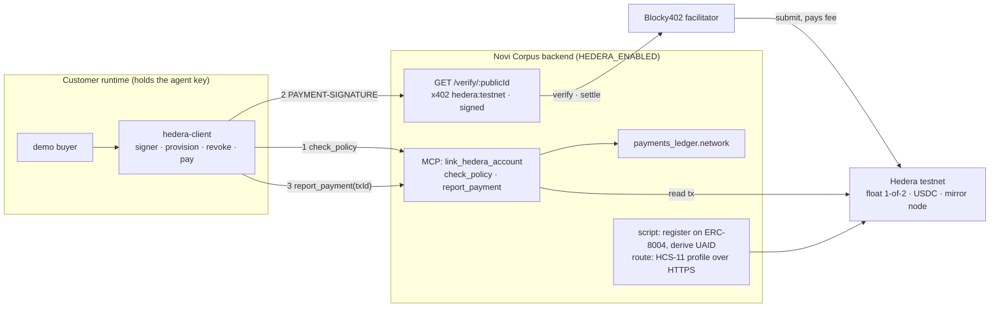

# Hedera rail — governed x402 payments, a paid legal-standing check, and portable identity

**Date:** 2026-09-10 · **Area:** `back/backend` (Hono/TS) plus a new `back/hedera-client` package · **Type:** flag-gated feature, testnet only · **Target:** ETHOnline 2026, Hedera "AI & Agentic Payments" track, deadline 2026-09-16 · **Plan:** `docs/plans/2026-09-10-hedera-rail.md`

> **Status:** DESIGN v3, 2026-09-10, sound to build. v1 came out of a brainstorming pass with Alex that settled the custody shape and the names (D1 to D13). v2 followed a grilling pass over the design tree (D14 to D21). v3 followed an independent second review that verified sixteen claims by execution or source, found five gaps against the definition of done and three wrong facts, all folded here (D22 to D27; the Pre-cleared section corrected in place, no ✎ marks kept since the doc was unmerged). Grounded on `main` at `bea70d1` (PRs #120 and #126 in) and on the signer spike executed on Hedera testnet 2026-09-09. **Method:** decisions are the table under "Decided"; facts a task may cite without re-checking are under "Pre-cleared"; anything not in either is the plan's to verify. Companions: the idea brief and the start-now note in Alex's vault, `docs/research/2026-09-09-hedera-signer-spike-findings.md`.

## Goal

Three things, built in this order, one pull request each:

1. **The rail.** A Novi Corpus entity's agent pays x402 resources priced in Hedera USDC through the Blocky402 facilitator, under the same policy gate, caps and guardian pause as on Arc. Novi Corpus hosts `GET /verify/:publicId` as the paid route, serving the same body as the free `/legal-bodies` lookup in this pull request. Both halves are what the track requires.
2. **Portable identity.** Each Novi Corpus company is registered in the ERC-8004 registry on Hedera testnet, carries an HCS-14 universal agent id (UAID), and publishes an HCS-11 profile, so an agent holding the UAID can resolve the company through Novi Corpus's lookup and check it before dealing with it.
3. **The legal-standing check.** `/verify` gains the controller-verified flag, the operating-agreement hash and version, and an EIP-712 signature with `issuedAt` and `expiresAt`, so the paid answer is an attestation a buyer can verify offline. The scripted buyer lands here too.

Definition of done is the live run, not a green suite: a scripted buyer resolves a Novi Corpus company from its UAID, pays `/verify` through Blocky402 with the settlement visible on HashScan, the guardian pauses the entity on Arc with the guardian script and the buyer's next payment is refused by the client, then the guardian rotates the agent key on Hedera and the chain refuses the one after.

## Pre-cleared, do not re-verify

Read in source or executed on testnet on 2026-09-09 and 2026-09-10 (`docs/research/2026-09-09-hedera-signer-spike-findings.md`):

- A secp256k1 signer that only sees a 32-byte digest signs Hedera transactions byte-identically to the SDK, via `transaction.signWith`. The custody boundary is one function: `rawSign(digest32) => sig64`.
- One guardian-signed USDC transfer to the agent key's EVM address creates the float account with USDC associated and unlimited auto-associations. No HBAR is ever needed on the agent account: the facilitator pays the fee, and the network completed the hollow account inside its first x402 settlement.
- A 1-of-2 `KeyList(guardian, agent)` on the float account lets the agent pay alone; the guardian alone rotates the agent key out; the next agent payment fails on chain with `INVALID_SIGNATURE`. Blocky402 submits it and reports `transaction_failed` after the fact.
- Blocky402 testnet: `https://api.testnet.blocky402.com`, lists `hedera:testnet`, scheme `exact`, fee payer `0.0.7162784`, default `aliasPolicy: reject` on `payTo` (sellers need a completed account; payers may be hollow). USDC is HTS token `0.0.429274`, 6 decimals. Requirements shape: `{ scheme: "exact", network: "hedera:testnet", payTo, price: { amount: "1000", asset: "0.0.429274" } }`.
- Verified x402 v2 API names: server `HTTPFacilitatorClient` (`@x402/core/server`), `x402ResourceServer(...).register("hedera:*", new ExactHederaScheme())` (`@x402/hedera/exact/server`), `paymentMiddleware` (`@x402/hono@2.25.0`; `@x402/paywall` is an optional peer, not installed); client `x402Client().register("hedera:*", new ExactHederaScheme(signer))` (`@x402/hedera/exact/client`), `x402Client.onBeforePaymentCreation` (can abort), `wrapFetchWithPayment`, `decodePaymentResponseHeader` (`@x402/fetch`); response header `PAYMENT-RESPONSE`.
- `@x402/hono`'s middleware, read in source: a refusal at verify returns the facilitator's 402 before the handler; a refusal at settle replaces the handler's response with the facilitator's 402; a handler status of 400 or above cancels settlement and passes through. Middleware registered ahead of it runs first.
- `@x402/hedera@2.25.0` pins `@hiero-ledger/sdk@2.85.0` and `@x402/core ~2.25`. Import SDK symbols from `@x402/hedera`; `AccountUpdateTransaction` and `KeyList` from `@hiero-ledger/sdk`. Never install `@hashgraph/sdk` beside it.
- The backend imports nothing from `@x402/*` or `x402` in `src/`; only `@circle-fin/x402-batching` (peer `@x402/core ^2.3`), one test and one spike script import `x402/types`; `x402-fetch` has no importer. Bumping `@x402/evm` to `^2.25` is low risk and is still task 1.
- ERC-8004 on Hedera testnet (chain id 296, relay `https://testnet.hashio.io/api`): EIP-1967 proxies at `0x8004A818BFB912233c491871b3d84c89A494BD9e` (identity), `0x8004B663…8713` (reputation), `0x8004Cb1B…4272` (validation), whose implementation carries `register(string)` and `setMetadata`, the same ABI as Arc.
- HCS-14, read in the standards SDK source (`src/hcs-14/canonical.ts`, `did.ts`): the `aid` id is SHA-384 over canonical JSON of `skills`, `name`, `nativeId`, `protocol`, `registry`, `version` in that key order, Base58; `registry` and `protocol` are lowercased, `nativeId` only trimmed. No chain write. The SDK (`@hashgraphonline/standards-sdk@0.1.186`) depends on `@hashgraph/sdk`, so it is not installed; the derivation is reimplemented and pinned to a golden vector generated once from a scratch install of the SDK (its tests carry a canonical-JSON vector, not an end-to-end one).
- `AgentTreasury.pause()` and `unpause()` are `onlyGuardian` (`src/AgentTreasury.sol:178`); nothing in the backend, MCP or scripts calls them today.
- Testnet accounts: treasury and guardian `0.0.10412145` (ECDSA, USDC-associated), spare `0.0.10412694` (ECDSA, 1000 HBAR, no tokens) as the platform operator, spike agent `0.0.10450558` (key rotated to the guardian). Keys live in 1Password vault "Novi Corpus"; scripts run under `op run --env-file=.env.tpl`.
- Main already has: `payments/legalBody.ts` (one definition of standing), `GET /legal-bodies/:address` (PR #126, claims ceiling D7), `formationSummary`, the metadata route's `worldId` and `registrations[]` blocks, and Martin's rule from PR #120 that a settlement outcome comes from the chain, never from the submitter's reply.

## Decided, do not re-litigate

Settled with Alex on 2026-09-10. Each is reversible later; none is reopened inside this build.

| # | Decision |
|---|---|
| D1 | **Custody is "self-custody."** The customer's runtime holds the agent key. Novi Corpus's server never signs a Hedera transaction and never holds a key over customer funds. The two server-side alternatives ("Turnkey delegate", "Novi Corpus-held key") differ only in what `rawSign` calls; their delta is isolated in the plan's last task. |
| D2 | **Enforcement is said out loud.** The server cannot block a payment it does not sign. The rules hold because the client package refuses when `check_policy` says no, and because the guardian controls the float on chain (its size, and key rotation). The design doc, the README and the demo say exactly this. |
| D3 | **Novi Corpus provisions nothing on Hedera in this build.** Every provisioning signature is the customer's (guardian funds the float, agent and guardian set the key list). The client's `provision` command does it; `link_hedera_account` records the result. A Novi Corpus-side seed transfer at formation is a later option, noted in Non-goals. |
| D4 | **The client lives in `back/hedera-client/`**, a standalone package like the other three in the monorepo (no workspaces exist). It holds the signer, the commands and the demo buyer. Moving it under `back/backend/` later is a folder move. |
| D5 | **Names.** Flag `HEDERA_ENABLED`; family `HEDERA_*`; attestation key `NOVI_ATTESTATION_KEY`. Ledger column `payments_ledger.network`, CAIP-2 values, nullable: `NULL` means the configured Arc chain (`eip155:${chainId}`), so existing rows are never mislabelled by a mainnet flip. Full table in the plan. |
| D6 | **The attestation key is dedicated.** secp256k1, EIP-712, address published in the metadata JSON. Boot refuses it if it equals any other key or operator address on the box (the PR #120 invariant list). Redacted in the config dump. Testnet only this window; lives in Alex's 1Password for the demo, in the VPS `.env` if it ever runs there. |
| D7 | **`/anchor` is cut.** Idea 2 is `/verify` plus the scripted buyer. |
| D8 | **`check_policy` is a pure read.** No reservation row: an authorization the agent never closes would count against the cap forever and the server cannot force the close. `report_payment` writes `settled` or `failed` after reading the mirror node. |
| D9 | **`/verify` is the paid, signed twin of `/legal-bodies/:address`**: same resolver, same claims ceiling ("a registered legal body in good standing", never "verified company" or "KYC'd"), keyed by `publicId`, plus the controller-verified flag, the operating-agreement hash and version, and a signature with `issuedAt` and a 5-minute `expiresAt`. An unknown `publicId` answers 404 before any 402 is issued, so nobody pays for "none". A refusal at verify or at settle answers the facilitator's 402 and no attestation is served. |
| D10 | **UAID inputs and parameters.** Hash inputs: `registry=novicorpus`, `name=<entity name>`, `version=1`, `protocol=mcp`, `nativeId=eip155:5042002:<treasury, lowercased>`, `skills=[]`. Routing parameters after the hash: `uid=<Arc ERC-8004 agentId>`, `registry`, `proto`, `nativeId`. `nativeId` is lowercased before hashing and pinned, because the SDK only trims it and each spelling hashes differently. A renamed entity gets a new UAID; the doc says so. Derivation identical to the standards SDK, with a code comment stating why the SDK is not imported. |
| D11 | **HCS-11 profile is served over HTTPS.** The standard accepts an HTTPS reference in the account memo, so the profile is a route, `GET /metadata/:publicId/profile`, not a topic write: no platform topic, no `hcs11_*` columns, no Hedera SDK in the backend. Setting the memo `hcs-11:<profile URL>` needs the customer's key, so the client's `provision` command does it. An HCS-1 copy on the consensus log is a later upgrade. |
| D12 | **`custody: "self"` is not added to the enum** (15 code sites, and the onboarding saga branches on it). An entity is on the Hedera rail when it has a linked Hedera account. Its Arc custody is untouched. |
| D13 | **Settled means seen on chain.** `report_payment` accepts a transaction id, reads it from the mirror node, and marks `settled` only for `SUCCESS` with a USDC transfer from the linked account to the reported payee of the reported amount. Anything else is `failed`; an unresolvable read is retried, never guessed. |
| D14 | **The float is the cap.** `check_policy` passes the float account's USDC balance, read from the mirror node at check time, as `available`. `perTxCap`, `paused` and `legalActive` apply unchanged. The Arc treasury leash is never consulted for a Hedera payment. |
| D15 | **Allowlist fails closed on Hedera, intentionally, for ETHOnline 2026.** The payee allowlist is `isAllowed(address)` on the Arc vault and cannot hold a Hedera account id. While an entity's allowlist is enabled, `check_policy` returns `not-allowlisted` for every Hedera payee, and the over-threshold rule does the same. The code comment and the README say this is a hackathon decision; an off-chain Hedera allowlist is a backlog item. |
| D16 | **`report_payment` waits for the mirror node, briefly.** The server polls for up to 10 seconds, then answers `pending` without writing a row; the client retries the same report. The partial unique index makes a late duplicate harmless. |
| D17 | **The demo shows one paid service.** Discover by UAID, pay `/verify`, the guardian pauses and the client refuses the next payment, the guardian rotates the key and the chain refuses the one after. Paying a Novi Corpus company for a job on Hedera would need a company-side Hedera sell route; it is left out on purpose and can be built later, by anyone on the team. |
| D18 | **Demo entity is `FormationE2E_1`** (completed sandbox formation, verified controller), with `TestBootstrapMB_1` as the fallback. |
| D19 | **The platform operator account owns the Hedera ERC-8004 registration**, as the platform makes the Arc one. The shared metadata URI binds both registrations to the company. |
| D20 | **The three pull requests merge with merge commits** (`gh pr merge --merge`), not squashes, so the task-per-commit history survives for the ETHGlobal continuity rule. Main has no branch protection. The continuity README says so. |
| D21 | **The demo backend runs locally** with the flag on, like the World demo. Enabling `/verify` on the VPS is an optional last-day task done with Martin. |
| D22 | **The guardian pause is a script.** `scripts/guardian-pause.mts pause|unpause --entity <id>` sends `pause()` or `unpause()` on the entity's `AgentTreasury` on Arc from the guardian key. Plan task 0 confirms who holds the demo entity's guardian key and that the demo can sign with it. |
| D23 | **Discovery is a Novi Corpus resolver, said plainly.** A UAID is derived, never indexed. The buyer parses `nativeId` out of the UAID, calls `/legal-bodies/:address`, follows the metadata link to the profile. Nothing on Hedera links the UAID to the float account except that resolver. |
| D24 | **The link binds the guardian too.** `link_hedera_account` reads the float account from the mirror node and accepts only a threshold-1 key list of exactly two keys, one equal to `publicKey`; it records the other as `hedera_guardian_public_key`. A sole-key account is refused: without the leash, D2's enforcement story would be unrecorded. |
| D25 | **`/verify` ships in pull request 1** as the rail's sell half, serving the unsigned lookup body. Pull request 3 adds the controller fields, the signature and the demo buyer. Pull request 2 is identity. |
| D26 | **`payTo` for the demo is the spare account `0.0.10412694`**, associated with USDC in task 0, not the guardian's treasury, so the settlement on HashScan is not a circle from the guardian back to the guardian. |
| D27 | **The cut line.** If Friday 2026-09-12 ends without one paid `/verify` settled on HashScan, pull request 2 shrinks to registration plus UAID (no profile route), pull request 3 to the demo buyer against the unsigned `/verify`, and the video shows that. |

## Architecture

The Arc buyer path (`pay` → `EntityPaymentService` → Circle Gateway) is untouched. Hedera adds a second sell route, three MCP tools, one ledger column, a handful of entity columns, and a client package.

## Components

### 1. Config — `src/config/env.ts`
`HEDERA_ENABLED` (truthy string, the `WORLD_REQUIRE_GUARDIAN` idiom). When on, a `hedera` block is required whole: `HEDERA_NETWORK=testnet`, `HEDERA_FACILITATOR_URL`, `HEDERA_MIRROR_URL`, `HEDERA_USDC_TOKEN_ID`, `HEDERA_PAYTO_ACCOUNT_ID`, `HEDERA_VERIFY_PRICE_USDC` (default `0.001`), `NOVI_ATTESTATION_KEY`. A half-configured block refuses to boot, with the key-role invariants of D6; the attestation key is redacted in the dump. The registration script reads its own env, never the server: `HEDERA_JSON_RPC_URL`, `HEDERA_IDENTITY_REGISTRY`, `HEDERA_OPERATOR_ACCOUNT_ID`, `HEDERA_OPERATOR_KEY`. A hot key the server never uses does not belong in the server's boot block.

### 2. Persistence — `src/persistence/db.ts`
ALTER-if-missing, the house idiom. `payments_ledger.network TEXT` (nullable, D5); a partial unique index on `(network, batch_ref)` where `network` is not `NULL`, so a Hedera transaction id is reported once, and that index, not `idempotencyKey`, is what governs a duplicate report. `entities` gains `hedera_account_id`, `hedera_agent_public_key`, `hedera_guardian_public_key`, `hedera_linked_at`, `hedera_agent_id`, `hedera_register_tx`, `uaid`. Hedera rows never carry `authorized`, so `runningPending` (which sums `authorized` rows) is unaffected; the outflow meter reads `platform_outflows`, which Hedera does not write, so the dashboard's Hedera spend comes from `settled` ledger rows by `network`. Nothing else filters on `network`.

### 3. Sell route — `src/api/routes/verify.ts`, `src/payments/hederaSeller.ts`
Public, unauthenticated, mounted only when the flag is on, beside `mountLegalBodyRoutes`. Three layers on the path, registered in this order: the `/legal-bodies` rate limiter and a guard that answers 404 for an unknown `publicId`; then `paymentMiddleware` from `@x402/hono@2.25.0` built from `x402ResourceServer(new HTTPFacilitatorClient({ url }))` with `ExactHederaScheme` registered on `hedera:*` and the route priced `{ amount, asset: usdcTokenId }` on `hedera:testnet` with `payTo`; then the handler. The middleware issues the 402, verifies and settles through Blocky402, and discards the handler's response on a failed settle (pre-cleared). The served body is built by `src/hedera/attestation.ts` from `LegalBodyResolver.readStanding`, `formationSummary`, the World verification store and the entity row; pull request 3 adds the EIP-712 signature with `NOVI_ATTESTATION_KEY` (domain `{ name: "Novi Corpus Attestation", version: "1" }`, no `chainId`, since the statement is about a company, not a chain). Known risk, stated in the README: a buyer whose connection drops after settle has paid without receiving the body; the attestation is cheap and the buyer retries.

### 4. MCP tools — `src/mcp/server.ts`
Three `registerTool` additions, snake_case like the other twenty-two, tenant- and scope-gated like `pay`:
- `link_hedera_account { id, accountId, publicKey }` reads the account from the mirror node and applies D24: a threshold-1 key list of exactly two keys, one equal to `publicKey`, the other recorded as the guardian; then writes the columns and `hedera_linked_at`. A second link is refused unless the values are the same.
- `check_policy { id, payee, amountUsdc, network }` runs `evaluatePolicy` with `paused` and `legalActive` from Arc, `available` from the float balance on the mirror node (D14), and the allowlist rule of D15. Returns `{ ok }` or `{ ok: false, reason }`. Pure read (D8). An entity with no linked account gets `not-linked`.
- `report_payment { id, payee, amountUsdc, network, transactionId, idempotencyKey }` reads the mirror node (`src/hedera/mirror.ts`) with the D16 wait, applies D13, inserts the ledger row with `network`, returns `settled`, `failed` or `pending`.

### 5. Identity — `src/hedera/uaid.ts`, `src/hedera/registry.ts`, `src/api/routes/profile.ts`, `scripts/hedera-register-identity.mts`
The script takes `--entity <id>` or `--all`. Registration is a viem write to the Hedera identity registry over the JSON-RPC relay with the platform operator key and the same metadata URI as Arc; the Hedera agent id and transaction hash land on the row (D19). UAID derivation is pure and unit-tested against the SDK vector (D10). `GET /metadata/:publicId/profile` serves the HCS-11 document (`version`, `type: 1`, `display_name`, `uaid`, `aiAgent { type, capabilities, model }`, `properties` with the legal fields and the verify URL) (D11). The metadata route adds the Hedera entry to `registrations[]`, `uaid`, and a `hedera { accountId, verifyUrl, profileUrl }` block. Today `registrations[]` is emitted only when ENS is configured; the Hedera entry must not inherit that gate, so the array is built whenever either registration exists. The backend needs no Hedera SDK: registry writes go through viem, reads through the mirror node's REST API.

### 6. Guardian script — `scripts/guardian-pause.mts`
`pause` or `unpause` on the entity's `AgentTreasury` from the guardian key over the Arc RPC (D22). Reads the guardian key from its own env under `op run`; refuses if the key's address is not the entity's on-chain `guardian()`. This is the demo's pause leg and the first script anywhere in the repo to exercise the guardian's pause.

### 7. Client — `back/hedera-client/`
`@novicorpus/hedera-client`, private. Pinned `@x402/hedera@2.25.0`, `@x402/fetch@2.25.0`, `@x402/core@2.25.0`, `@noble/curves@1.8.1`, `@noble/hashes@1.7.1`, `@modelcontextprotocol/sdk@1.29.0`. Modules: `signer.ts` (the spike's `custodyAgnosticSigner` with `rawSign` injected; `localKey` adapter now, KMS and Turnkey adapters are the same interface), `policy.ts` (MCP client for the three tools), `pay.ts` (`wrapFetchWithPayment`; `check_policy` runs inside `x402Client.onBeforePaymentCreation`, which receives the selected requirements and aborts on a deny; `report_payment` runs after `PAYMENT-RESPONSE`, retried on `pending`). Commands under `novi-hedera`: `provision` (float account by guardian USDC transfer, 1-of-2 key list, account memo `hcs-11:<profile URL>`), `revoke` (guardian-only rotation), `pay <url>`, `demo-buyer` (resolve by UAID → fetch the profile → pay `/verify`, then the pause and rotation legs of D17). Secrets only via `op run`. `provision` sets the key list on a hollow account with no payment in between, which the spike did not do (it paid first); the provision task tests that order first and falls back to a dust self-transfer if the network wants a completing transaction.

### Files the build touches beyond the new ones
`src/api/main.ts` and `src/api/app.ts` (wiring, `ApiDeps`), the MCP deps type in `src/mcp/server.ts`, `src/payments/policyGate.ts` (`payee` is typed `Address`; Hedera passes an account id string), `src/types.ts` and `src/persistence/entityRepository.ts` (the seven columns), `src/payments/ledger.ts` (the `network` insert), `src/api/routes/metadata.ts` (the ungated `registrations[]`), `package.json` (the bump, `@x402/hono`, drop `x402-fetch`), `.env.example`, `README.md`. This list is the baseline for a later "file not in scope" check.

## Security

- Novi Corpus holds no key over customer funds (D1). The platform operator key signs registry writes from its own account and is read only by the registration script; the attestation key signs statements and is role-locked at boot (D6). The guardian key used by the pause script is the demo entity's own guardian, never a platform key.
- `/verify` says only what the on-chain status and the stored formation record carry (D9). `standing: "unknown"` is served as unknown, never memoised, `Cache-Control: no-store`.
- `report_payment` is a claim the server checks on chain before it counts (D13); a transaction id counts once.
- Public routes are rate-limited like `/legal-bodies`; no user input reaches config; the paid body has no PII (no EIN, no filing number, no party data).
- Testnet only. No `.env` is read by any script; `op run` injects secrets.

## Testing

Unit, no network: config boot matrix (flag off, on and whole, on and partial, key-role collisions); ledger `network` nullable semantics and the partial unique index; the `/verify` layer order (404 for an unknown `publicId` with no 402 issued; rate limit before payment); `check_policy` decision table including the float-balance cap, the fail-closed allowlist and `not-linked`; `link_hedera_account` against a mocked mirror (two-key threshold-1 list accepted and the guardian recorded; sole key, three keys, threshold 2, and a list without `publicKey` refused); `report_payment` against a mocked mirror (success, wrong payee, wrong amount, `INVALID_SIGNATURE`, not-yet-visible → `pending`); the profile route's required fields; attestation build and EIP-712 verify round trip; UAID equals the pinned golden vector; `/verify` 402 body, malformed header, and a happy path with facilitator stubbed. Live, gated by env and run from 1Password: task 0 (demo entity is public on chain with an Arc agent id, a `publicId`, a World-verified guardian and a guardian key the demo can sign with; spare account associated with USDC; HCS-11 re-read from the raw markdown with `aid` chosen), task-1 bump suite, one paid `/verify` on testnet, registration of one entity, `guardian-pause.mts` round trip, the demo script end to end. Every plan task names its expected output as a literal string and a "do not proceed if" line.

## If the team picks a server-side custody instead

"Turnkey delegate" or "Novi Corpus-held key": add a `hedera:testnet` branch to `EntityPaymentService.pay` that builds the same signer with `rawSign` bound to Turnkey raw-payload signing or a KMS; provisioning moves into onboarding Step 0 beside the Circle branch; `link_hedera_account` becomes unnecessary; `check_policy` and `report_payment` stay useful for outside runtimes. One plan task, swappable.

## Non-goals

`/anchor` (D7). `custody: "self"` in the enum (D12). Formation-time or Novi Corpus-seeded provisioning (D3). An off-chain Hedera payee allowlist (D15, backlog). A company-side Hedera sell route so a buyer can pay a Novi Corpus company for a job (D17, intentional, open to any team member later). An HCS-1 copy of the profile on the consensus log (D11). Native Hedera allowances instead of the float account. Mainnet. A seller-side ledger of inflows. Removing the one `x402/types` import from the Arc test and spike (the `x402` v1 package stays; only `x402-fetch` is dropped). Any change to the Arc rail or its wire format. The idea 4 HCS audit trail per company. Continuity README and video (separate, last).
