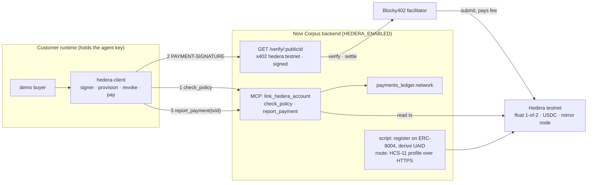

# Hedera rail — governed x402 payments, a paid legal-standing check, and portable identity

**Date:** 2026-09-10 · **Area:** `back/backend` (Hono/TS) plus a new `back/hedera-client` package · **Type:** flag-gated feature, testnet only · **Target:** ETHOnline 2026, Hedera "AI & Agentic Payments" track, deadline 2026-09-16 · **Plan:** `docs/plans/2026-09-10-hedera-rail.md`

> **Status:** DESIGN v4.1, 2026-09-11, sound to build; Martin's review folded (D28 deploy answer, D29 integration branch `hedera`, D30 Arc option on `/verify`, "Asks of Martin" answered). v4 was 2026-09-10. **ADVERSARIALLY AUDITED 2026-09-10:** five passes (source anchors, npm packages and the spike, live endpoints, house structure, spec-to-plan coverage), 13 pre-cleared claims re-executed, 12 confirmed, 1 corrected (the middleware's lazy `initialize()`, marked ✎ below), 35 findings against the plan of which 8 were blockers, 2 new decisions (D28 topology, D29 merge policy). Corrections are marked ✎ in place and traced in the last section. v1 came out of a brainstorming pass with Alex that settled the custody shape and the names (D1 to D13). v2 followed a grilling pass over the design tree (D14 to D21). v3 followed an independent second review that verified sixteen claims by execution or source, found five gaps against the definition of done and three wrong facts, all folded here (D22 to D27; the Pre-cleared section corrected in place). Grounded on `main` at `bea70d1` (PRs #120 and #126 in) and on the signer spike executed on Hedera testnet 2026-09-09. **Method:** decisions are the table under "Decided"; facts a task may cite without re-checking are under "Pre-cleared"; anything not in either is the plan's to verify. Companions: the idea brief and the start-now note in Alex's Obsidian vault, `docs/research/2026-09-09-hedera-signer-spike-findings.md`.

## Goal

Three things, built in this order, one pull request each:

1. **The rail.** A Novi Corpus entity's agent pays x402 resources priced in Hedera USDC through the Blocky402 facilitator, under the same policy gate, caps and guardian pause as on Arc. Novi Corpus hosts `GET /verify/:publicId` as the paid route, serving the full unsigned attestation body in this pull request (✎ v4: was "the same body as the free `/legal-bodies` lookup"; the plan builds the controller and operating-agreement fields in PR 1 and PR 3 adds only the signature, D25). Both halves are what the track requires.
2. **Portable identity.** Each Novi Corpus company is registered in the ERC-8004 registry on Hedera testnet, carries an HCS-14 universal agent id (UAID), and publishes an HCS-11 profile, so an agent holding the UAID can resolve the company through Novi Corpus's lookup and check it before dealing with it.
3. **The legal-standing check.** `/verify` gains the controller-verified flag, the operating-agreement hash and version, and an EIP-712 signature with `issuedAt` and `expiresAt`, so the paid answer is an attestation a buyer can verify offline. The scripted buyer lands here too.

Definition of done is the live run, not a green suite: a scripted buyer resolves a Novi Corpus company from its UAID, pays `/verify` through Blocky402 with the settlement visible on HashScan, the guardian pauses the entity on Arc with the guardian script and the buyer's next payment is refused by the client, then the guardian rotates the agent key on Hedera and the chain refuses the one after.

## Pre-cleared, do not re-verify

Read in source or executed on testnet on 2026-09-09 and 2026-09-10 (`docs/research/2026-09-09-hedera-signer-spike-findings.md`):

- A secp256k1 signer that only sees a 32-byte digest signs Hedera transactions byte-identically to the SDK, via `transaction.signWith`. The custody boundary is one function: `rawSign(digest32) => sig64`.
- One guardian-signed USDC transfer to the agent key's EVM address creates the float account with USDC associated and unlimited auto-associations. No HBAR is ever needed on the agent account: the facilitator pays the fee, and the network completed the hollow account inside its first x402 settlement.
- A 1-of-2 `KeyList(guardian, agent)` on the float account lets the agent pay alone; the guardian alone rotates the agent key out; the next agent payment fails on chain with `INVALID_SIGNATURE`. Blocky402 submits it and reports `transaction_failed` after the fact.
- Blocky402 testnet: `https://api.testnet.blocky402.com`, lists `hedera:testnet`, scheme `exact`, fee payer `0.0.7162784`, default `aliasPolicy: reject` on `payTo` (sellers need a completed account; payers may be hollow). USDC is HTS token `0.0.429274`, 6 decimals. Requirements shape: `{ scheme: "exact", network: "hedera:testnet", payTo, price: { amount: "1000", asset: "0.0.429274" } }`.
- Verified x402 v2 API names: server `HTTPFacilitatorClient` (`@x402/core/server`), `x402ResourceServer(...).register("hedera:*", new ExactHederaScheme())` (`@x402/hedera/exact/server`), `paymentMiddleware` (`@x402/hono@2.25.0`; `@x402/paywall` is an optional peer, not installed); client `x402Client().register("hedera:*", new ExactHederaScheme(signer))` (`@x402/hedera/exact/client`), `x402Client.onBeforePaymentCreation` (can abort), `wrapFetchWithPayment`, `decodePaymentResponseHeader` (`@x402/fetch`); response header `PAYMENT-RESPONSE`.
- `@x402/hono`'s middleware, read in source: a refusal at verify returns the facilitator's 402 before the handler; a refusal at settle replaces the handler's response with the facilitator's 402; a handler status of 400 or above cancels settlement and passes through. Middleware registered ahead of it runs first. ✎ v4: `paymentMiddleware(routes, server, paywallConfig?, paywall?, syncFacilitatorOnStart = true)` initializes **only** when that last argument is true; with `false` its `initializeHttpServer()` returns at once (`dist/cjs/index.js:163`) and a never-initialized server throws `Facilitator does not support exact on hedera:testnet. Make sure to call initialize()` on the first request, which the middleware answers as 500. There is no lazy initialization. Keep the default; tests stub `GET /supported`.
- x402 v2 carries the payment requirements only in the `PAYMENT-REQUIRED` response header (base64 JSON); the 402 JSON body is `{}` (`@x402/core` `createHTTPPaymentRequiredResponse`). `ExactHederaScheme` on the server fills `extra.feePayer` from the facilitator's `/supported` kind during `initialize()`; the client throws without it. Route keys accept `:param`, `[param]` and `*` (`parseRoutePattern`), so `"GET /verify/:publicId"` matches a UUID segment and no more.
- The client's `onBeforePaymentCreation` hook receives `{ paymentRequired, selectedRequirements }` and aborts by returning `{ abort: true, reason }`; the abort surfaces from `wrapFetchWithPayment` as a thrown `Error("Failed to create payment payload: Payment creation aborted: <reason>")`, never as a 402. `createPartiallySignedTransferTransaction` is a method on `ClientHederaSigner`, not a package export. `HTTPFacilitatorClient` takes `{ url?, timeoutMs?, createAuthHeaders? }` and has no `fetch` option.
- The spike's post-rotation failure is on the mirror node as `CRYPTOTRANSFER INVALID_SIGNATURE` at consensus `1788998650.137740104`, transaction id `0.0.7162784-1788998641-694375378`, with an empty `token_transfers` list, listed under the payer (the facilitator) and not under the agent account. The mirror node answers an unknown transaction id with HTTP 404 and `{"_status":{"messages":[{"message":"Not found"}]}}`.
- The platform operator's key derives to the same EVM address the mirror node reports as `evm_address` for `0.0.10412694` (verified by Alex 2026-09-10), so a viem write over the JSON-RPC relay spends that account's HBAR. The identity proxy's EIP-1967 slot holds `0x7274e874ca62410a93bd8bf61c69d8045e399c02`; the contract answers `name()` with `AgentIdentity` and `ownerOf(1)` resolves.
- Prod's `/config` reports `formationPaymentRequired: false` and `formationEnvironment: sandbox` (2026-09-10), so onboarding the paying demo entity on prod costs nothing.
- HCS-11 (spec at hol.org): the memo is `hcs-11:<protocol_reference>` and `https://{url}` is a listed reference type; the standards SDK's `fetchProfileByAccountId` (0.1.186, read in `dist/es`) branches only on `hcs://`, `ipfs://` and `ar://`, so an SDK-based resolver does not follow an HTTPS memo. Profile `type` values: 1 ai_agent, 2 mcp_server.
- `@x402/hedera@2.25.0` pins `@hiero-ledger/sdk@2.85.0` and `@x402/core ~2.25`. Import SDK symbols from `@x402/hedera`; `AccountUpdateTransaction` and `KeyList` from `@hiero-ledger/sdk`. Never install `@hashgraph/sdk` beside it.
- The backend imports nothing from `@x402/*` or `x402` in `src/`; only `@circle-fin/x402-batching` (peer `@x402/core ^2.3`), one test and one spike script import `x402/types`; `x402-fetch` has no importer. Bumping `@x402/evm` to `^2.25` is low risk and is still task 1.
- ERC-8004 on Hedera testnet (chain id 296, relay `https://testnet.hashio.io/api`): EIP-1967 proxies at `0x8004A818BFB912233c491871b3d84c89A494BD9e` (identity), `0x8004B663…8713` (reputation), `0x8004Cb1B…4272` (validation), whose implementation carries `register(string)` and `setMetadata`, the same ABI as Arc.
- HCS-14, read in the standards SDK source (`src/hcs-14/canonical.ts`, `did.ts`): the `aid` id is SHA-384 over canonical JSON of `skills`, `name`, `nativeId`, `protocol`, `registry`, `version` in that key order, Base58; `registry` and `protocol` are lowercased, `nativeId` only trimmed. No chain write. The SDK (`@hashgraphonline/standards-sdk@0.1.186`) depends on `@hashgraph/sdk`, so it is not installed; the derivation is reimplemented and pinned to a golden vector generated once from a scratch install of the SDK (its tests carry a canonical-JSON vector, not an end-to-end one).
- `AgentTreasury.pause()` and `unpause()` are `onlyGuardian` (`src/AgentTreasury.sol:178`); nothing in the backend, MCP or scripts calls them today.
- Testnet accounts: treasury and guardian `0.0.10412145` (ECDSA, USDC-associated), spare `0.0.10412694` (ECDSA, 1000 HBAR, no tokens) as the platform operator, spike agent `0.0.10450558` (key rotated to the guardian). Keys live in 1Password vault "Novi Corpus"; scripts run under `op run --env-file=.env.tpl`.
- Main already has: `payments/legalBody.ts` (one definition of standing), `GET /legal-bodies/:address` (PR #126, claims ceiling D7), `formationSummary`, the metadata route's `worldId` and `registrations[]` blocks, and Martin's rule from PR #120 that a settlement outcome comes from the chain, never from the submitter's reply.

## Decided, do not re-litigate

Settled with Alex on 2026-09-10. Each is reversible later; none is reopened inside this build.

| # | Decision |
|---|---|
| D1 | **Custody is "self-custody."** The customer's runtime holds the agent key. Novi Corpus's server never signs a Hedera transaction and never holds a key over customer funds. The two server-side alternatives ("Turnkey delegate", "Novi Corpus-held key") differ only in what `rawSign` calls; their delta is isolated in the plan's last task. |
| D2 | **Enforcement is said out loud.** The server cannot block a payment it does not sign. The rules hold because the client package refuses when `check_policy` says no, and because the guardian controls the float on chain (its size, and key rotation). The design doc, the README and the demo say exactly this. |
| D3 | **Novi Corpus provisions nothing on Hedera in this build.** Every provisioning signature is the customer's (guardian funds the float, agent and guardian set the key list). The client's `provision` command does it; `link_hedera_account` records the result. A Novi Corpus-side seed transfer at formation is a later option, noted in Non-goals. |
| D4 | **The client lives in `back/hedera-client/`**, a standalone package like the other three in the monorepo (no workspaces exist). It holds the signer, the commands and the demo buyer. Moving it under `back/backend/` later is a folder move. |
| D5 | **Names.** Flag `HEDERA_ENABLED`; family `HEDERA_*`; attestation key `NOVI_ATTESTATION_KEY`. Ledger column `payments_ledger.network`, CAIP-2 values, nullable: `NULL` means the configured Arc chain (`eip155:${chainId}`), so existing rows are never mislabelled by a mainnet flip. Full table in the plan. |
| D6 | **The attestation key is dedicated.** secp256k1, EIP-712, address published in the metadata JSON. Boot refuses it if it equals any other key or operator address on the box (the PR #120 invariant list). Redacted in the config dump. Testnet only this window; lives in Alex's 1Password for the demo, in the VPS `.env` if it ever runs there. |
| D7 | **`/anchor` is cut.** Idea 2 is `/verify` plus the scripted buyer. |
| D8 | **`check_policy` is a pure read.** No reservation row: an authorization the agent never closes would count against the cap forever and the server cannot force the close. `report_payment` writes `settled` or `failed` after reading the mirror node. |
| D9 | **`/verify` is the paid, signed twin of `/legal-bodies/:address`**: same resolver, same claims ceiling ("a registered legal body in good standing", never "verified company" or "KYC'd"), keyed by `publicId`, plus the controller-verified flag, the operating-agreement hash and version, and a signature with `issuedAt` and a 5-minute `expiresAt`. An unknown `publicId`, or an entity that is not yet public on chain (`isPublicOnChain` from `payments/legalBody.ts`: no proxy or treasury yet), answers 404 before any 402 is issued, so nobody pays for "none" or for a half-formed entity. A refusal at verify or at settle answers the facilitator's 402 and no attestation is served. |
| D10 | **UAID inputs and parameters.** Hash inputs: `registry=novicorpus`, `name=<entity name>`, `version=1`, `protocol=mcp`, `nativeId=eip155:<configured Arc chain id>:<treasury, lowercased>` (from config, never a literal, for the same reason as D5), `skills=[]`. Routing parameters after the hash: `uid=<Arc ERC-8004 agentId>`, `registry`, `proto`, `nativeId`. `nativeId` is lowercased before hashing and pinned, because the SDK only trims it and each spelling hashes differently. A renamed entity gets a new UAID; the doc says so. Derivation identical to the standards SDK, with a code comment stating why the SDK is not imported. |
| D11 | **HCS-11 profile is served over HTTPS.** The standard accepts an HTTPS reference in the account memo, so the profile is a route, `GET /metadata/:publicId/profile`, not a topic write: no platform topic, no `hcs11_*` columns, no SDK transaction objects in the backend (✎ v4 wording, see D24). Setting the memo `hcs-11:<profile URL>` needs the customer's key, so the client's `provision` command does it, on the paying entity's own float account with that entity's own profile URL (✎ v4: a memo describes its own account). An HCS-1 copy on the consensus log is a later upgrade; ✎ v4: the standards SDK resolver follows `hcs://`, `ipfs://` and `ar://` only, so that upgrade is what makes the profile resolvable by SDK-based agents, and the README says which resolvers work today. |
| D12 | **`custody: "self"` is not added to the enum** (15 code sites, and the onboarding saga branches on it). An entity is on the Hedera rail when it has a linked Hedera account. Its Arc custody is untouched. |
| D13 | **Settled means seen on chain.** `report_payment` accepts a transaction id, reads it from the mirror node, and marks `settled` only for `SUCCESS` with a USDC transfer from the linked account to the reported payee of the reported amount. Anything else is `failed`; an unresolvable read is retried, never guessed. |
| D14 | **The float is the cap.** `check_policy` passes the float account's USDC balance, read from the mirror node at check time, as `available`. `perTxCap`, `paused` and `legalActive` apply unchanged. The Arc treasury leash is never consulted for a Hedera payment. |
| D15 | **Allowlist fails closed on Hedera, intentionally, for ETHOnline 2026.** The payee allowlist is `isAllowed(address)` on the Arc vault and cannot hold a Hedera account id. While an entity's allowlist is enabled, `check_policy` returns `not-allowlisted` for every Hedera payee, and the over-threshold rule does the same. The code comment and the README say this is a hackathon decision; an off-chain Hedera allowlist is a backlog item. |
| D16 | **`report_payment` waits for the mirror node, briefly.** The server polls for up to 10 seconds, then answers `pending` without writing a row; the client retries the same report. The partial unique index makes a late duplicate harmless. |
| D17 | **The demo shows one paid service.** Discover by UAID, pay `/verify`, the guardian pauses and the client refuses the next payment, the guardian rotates the key and the chain refuses the one after. Paying a Novi Corpus company for a job on Hedera would need a company-side Hedera sell route; it is left out on purpose and can be built later, by anyone on the team. |
| D18 | **Two demo entities, one per role.** The company being checked is `FormationE2E_1` (completed sandbox formation, verified controller, onboarded by Martin; the check needs no key of its owner). The company that pays is a fresh entity onboarded by Alex in task 0 under his own wallet, named `HederaDemo_1`, because paying needs its tenant's API key and the pause leg needs its guardian key, and both of `FormationE2E_1`'s belong to Martin. The demo line becomes "Alex's agent company checks Martin's company before dealing with it." |
| D19 | **The platform operator account owns the Hedera ERC-8004 registration**, as the platform makes the Arc one. The shared metadata URI binds both registrations to the company. |
| D20 | **The three pull requests merge with merge commits** (`gh pr merge --merge`), not squashes, so the task-per-commit history survives for the ETHGlobal continuity rule. Main has no branch protection. The continuity README says so. ✎ v4: PRs #120 and #126 landed as squashes, so this is a deliberate change of recent practice; who merges and when is D29. |
| D21 | ~~**The demo backend runs locally** with the flag on, like the World demo. Enabling `/verify` on the VPS is an optional last-day task done with Martin.~~ ✎ v4: superseded by D28. A local backend with a fresh database has no row for a prod entity, and every hop after the first in the buyer's resolution lands on prod. |
| D22 | **The guardian pause is a script.** `scripts/guardian-pause.mts pause|unpause --entity <id>` sends `pause()` or `unpause()` on the entity's `AgentTreasury` on Arc from the guardian key. Plan task 0 confirms who holds the demo entity's guardian key and that the demo can sign with it. |
| D23 | **Discovery is a Novi Corpus resolver, said plainly.** A UAID is derived, never indexed. The buyer parses `nativeId` out of the UAID, calls `/legal-bodies/:address`, follows the metadata link to the profile. Nothing on Hedera links the UAID to the float account except that resolver. |
| D24 | **The link binds the guardian too.** `link_hedera_account` reads the float account from the mirror node and accepts only a threshold-1 key list of exactly two keys, one equal to `publicKey`; it records the other as `hedera_guardian_public_key`. A sole-key account is refused: without the leash, D2's enforcement story would be unrecorded. The mirror node returns a key list as a protobuf-encoded hex blob (`_type: ProtobufEncoded`, seen in the spike at step 4a), and `src/hedera/keyDecode.ts` decodes the protobuf `Key` message by hand because the server keeps its Hedera surface to REST and never constructs SDK transaction objects; `@hiero-ledger/sdk` is present only as `@x402/hedera`'s dependency for the server scheme (✎ v4: was "the backend has no Hedera SDK", which task 1 makes false). Accept only a `ThresholdKey` with threshold 1 and two inner ECDSA keys (33-byte, 66 hex characters; an ed25519 member is refused); a plain `KeyList` of two keys is 2-of-2, which the agent could never satisfy alone, so it is refused. The golden vectors for that decoder's tests are hand-built from the protobuf field layout and pinned in the plan. |
| D25 | **`/verify` ships in pull request 1** as the rail's sell half. ✎ v4: PR 1 serves the full unsigned body (subject, standing, formation, controller flag, operating-agreement hash and version, `issuedAt`, `expiresAt`); PR 3 adds the signature and the demo buyer. Pull request 2 is identity. |
| D26 | **`payTo` for the demo is the spare account `0.0.10412694`**, associated with USDC in task 0, not the guardian's treasury, so the settlement on HashScan is not a circle from the guardian back to the guardian. |
| D27 | **The cut line.** If Friday 2026-09-12 ends without one paid `/verify` settled on HashScan, pull request 2 shrinks to registration plus UAID (no profile route), pull request 3 to the demo buyer against the unsigned `/verify`, and the video shows that. |
| D28 | **Prod is the demo target** (decided by Alex 2026-09-10 after the audit). PR 1 and PR 2 deploy to the VPS before the demo; the plan's VPS task is required and runs before the demo buyer. The demo buyer resolves, pays and reports against `www.novicorpus.com`; the demo API key is minted on prod; `link_hedera_account` and `report_payment` reach prod over MCP; the identity script registers from Alex's machine and records the three identity values on the box with a `--record` invocation that needs no key. Pre-merge live checks of PR 1 run on a local backend against a locally onboarded throwaway entity; no production data leaves the box (the production database holds party data and encrypted SSN blobs, so a copy is not asked for). Consequence: the two scripts that touch the prod demo entities take their inputs from public endpoints or the command line (`--from-prod`, `--treasury`), never from the local database. Martin deploys the `hedera` integration branch on the box himself (his answer of 2026-09-11, option 1 in "Asks of Martin, with options"); the interface is untouched, so the box can run that branch for the demo. Fallback if a deploy fails on Sunday 2026-09-14: the local backend owns every hop, both demo entities are onboarded locally, and a tunnel URL is the metadata base. |
| D29 | **An integration branch `hedera`, and the merge policy for the window** (Martin's suggestion, agreed 2026-09-11; replaces the 2026-09-10 wording). `hedera` is cut from `main` after the docs PR that records this decision. The three Hedera code PRs target `hedera`, never `main`, and merge with merge commits (D20). Martin reviews each within 24 hours; after that window, green CI and Alex's own diff read, Alex self-merges into `hedera`, because the deadline is 2026-09-16. The box runs `hedera` for the demo. Whether `hedera` merges into `main` is decided together after the hackathon, as one pull request readable end to end, which is also the rollback: nothing on `main` changes until then. Docs PRs go to `main` and self-merge on green. |
| D30 | **`/verify` outlives the rail: an Arc payment option is the named follow-up** (Martin's suggestion, agreed 2026-09-11). The attestation body carries nothing Hedera-specific; only the payment middleware does. x402 v2 lets one route list several payment options (`RouteConfig.accepts: PaymentOption[]`) and `@x402/evm` registers `eip155:*`, so an Arc option is a second entry `{ scheme: "exact", network: "eip155:<chainId>", payTo, price: { amount, asset: usdc } }`. What Arc lacks is a facilitator for the standard `exact` scheme: Circle's Gateway settles the batching scheme, so Novi Corpus would facilitate itself with the PR #120 settle submitter. About one day of work, after 2026-09-16, and it lets `/verify` land on `main` whatever is decided about Hedera. |

## Architecture

The Arc buyer path (`pay` → `EntityPaymentService` → Circle Gateway) is untouched. Hedera adds a second sell route, three MCP tools, one ledger column, a handful of entity columns, and a client package.

## Components

### 1. Config — `src/config/env.ts`
`HEDERA_ENABLED` (truthy string, the `WORLD_REQUIRE_GUARDIAN` idiom). When on, a `hedera` block is required whole: `HEDERA_NETWORK=testnet`, `HEDERA_FACILITATOR_URL`, `HEDERA_MIRROR_URL`, `HEDERA_USDC_TOKEN_ID`, `HEDERA_PAYTO_ACCOUNT_ID`, `HEDERA_VERIFY_PRICE_USDC` (default `0.001`), `NOVI_ATTESTATION_KEY`. A half-configured block refuses to boot, with the key-role invariants of D6; the attestation key is redacted in the dump. The registration script reads its own env, never the server: `HEDERA_JSON_RPC_URL`, `HEDERA_IDENTITY_REGISTRY`, `HEDERA_OPERATOR_ACCOUNT_ID`, `HEDERA_OPERATOR_KEY`. A hot key the server never uses does not belong in the server's boot block.

### 2. Persistence — `src/persistence/db.ts`
ALTER-if-missing, the house idiom. `payments_ledger.network TEXT` (nullable, D5); a partial unique index on `(network, batch_ref)` where `network` is not `NULL`, so a Hedera transaction id is reported once, and that index, not `idempotencyKey`, is what governs a duplicate report. `entities` gains `hedera_account_id`, `hedera_agent_public_key`, `hedera_guardian_public_key`, `hedera_linked_at`, `hedera_agent_id`, `hedera_register_tx`, `uaid`. Hedera rows never carry `authorized`, so `runningPending` (which sums `authorized` rows) is unaffected; the outflow meter reads `platform_outflows`, which Hedera does not write, so the dashboard's Hedera spend comes from `settled` ledger rows by `network`. Nothing else filters on `network`.

### 3. Sell route — `src/api/routes/verify.ts`, `src/payments/hederaSeller.ts`
Public, unauthenticated, mounted only when the flag is on, beside `mountLegalBodyRoutes`. Three layers on the path, registered in this order: the `/legal-bodies` rate limiters (the per-client bucket and the shared bucket, both exported from `legalBodies.ts`) and a guard that answers 404 for an unknown `publicId`; then `paymentMiddleware` from `@x402/hono@2.25.0` built from `x402ResourceServer(new HTTPFacilitatorClient({ url }))` with `ExactHederaScheme` registered on `hedera:*` and the route priced `{ amount, asset: usdcTokenId }` on `hedera:testnet` with `payTo`; then the handler. The middleware fetches the facilitator's `/supported` at mount (the default `syncFacilitatorOnStart`, ✎ v4), issues the 402 with the requirements in the `PAYMENT-REQUIRED` header, verifies and settles through Blocky402, and discards the handler's response on a failed settle (pre-cleared). Fields the body allows to be `null` (`oaHash`, `manifestVersion`, `uaid`, `agentId`) map to the sentinels `0x00…00`, `0`, `""` and `""` in the EIP-712 message, on both the signing and the verifying side, and the README states them (✎ v4). The served body is built by `src/hedera/attestation.ts` from `LegalBodyResolver.readStanding`, `formationSummary`, the World verification store and the entity row; pull request 3 adds the EIP-712 signature with `NOVI_ATTESTATION_KEY` (domain `{ name: "Novi Corpus Attestation", version: "1" }`, no `chainId`, since the statement is about a company, not a chain). Known risk, stated in the README: a buyer whose connection drops after settle has paid without receiving the body; the attestation is cheap and the buyer retries.

### 4. MCP tools — `src/mcp/server.ts`
Three `registerTool` additions, snake_case like the other twenty-two, tenant- and scope-gated like `pay`:
- `link_hedera_account { id, accountId, publicKey }` reads the account from the mirror node and applies D24: a threshold-1 key list of exactly two keys, one equal to `publicKey`, the other recorded as the guardian; then writes the columns and `hedera_linked_at`. A second link is refused unless the values are the same.
- `check_policy { id, payee, amountUsdc, network }` runs `evaluatePolicy` with `paused` and `legalActive` from Arc, `available` from the float balance on the mirror node (D14), and the allowlist rule of D15. Returns `{ ok }` or `{ ok: false, reason }`. Pure read (D8). An entity with no linked account gets `not-linked`.
- `report_payment { id, payee, amountUsdc, network, transactionId, idempotencyKey }` reads the mirror node (`src/hedera/mirror.ts`) with the D16 wait, applies D13, inserts the ledger row with `network`, returns `settled`, `failed` or `pending`.

### 5. Identity — `src/hedera/uaid.ts`, `src/hedera/registry.ts`, `src/api/routes/profile.ts`, `scripts/hedera-register-identity.mts`
The script takes `--entity <id>` (repeatable) or `--all-entities` (✎ v4: the default registers only the entities named, so a run never registers other tenants' companies by accident), plus `--from-prod <publicId>` (reads the entity's public values from prod's `/metadata` and `/transparency`, since under D28 the local database never holds the prod rows) and `--record --entity <id> --agent-id <n> --tx <hash> --uaid <uaid>` to write an already-made registration into the database on the box (D28). Registration is a viem write to the Hedera identity registry over the JSON-RPC relay with the platform operator key and the same metadata URI as Arc; the Hedera agent id and transaction hash land on the row (D19). UAID derivation is pure and unit-tested against the SDK vector (D10). `GET /metadata/:publicId/profile` serves the HCS-11 document (`version`, `type: 1`, `display_name`, `uaid`, `aiAgent { type, capabilities, model }`, `properties` with the legal fields and the verify URL) (D11). The metadata route adds the Hedera entry to `registrations[]`, `uaid`, and a `hedera { accountId, verifyUrl, profileUrl }` block. Today `registrations[]` is emitted only when ENS is configured; the Hedera entry must not inherit that gate, so the array is built whenever either registration exists. The server keeps its Hedera surface to REST and never constructs SDK transaction objects: registry writes go through viem, reads through the mirror node's REST API; `@hiero-ledger/sdk` is present only as `@x402/hedera`'s dependency for the server scheme (✎ v4). The Hedera identity registry address is a public constant in `src/hedera/registry.ts`, imported by the script and by the metadata route, never read from the server's environment (✎ v4).

### 6. Guardian script — `scripts/guardian-pause.mts`
`pause` or `unpause` on the entity's `AgentTreasury` from the guardian key over the Arc RPC (D22), addressed by `--entity` from the local database or by `--treasury <address>` with no database at all (the demo's case under D28). Reads the guardian key from its own env under `op run`; refuses if the key's address is not the treasury's on-chain `guardian()`. This is the demo's pause leg and the first script anywhere in the repo to exercise the guardian's pause.

### 7. Client — `back/hedera-client/`
`@novicorpus/hedera-client`, private. Pinned `@x402/hedera@2.25.0`, `@x402/fetch@2.25.0`, `@x402/core@2.25.0`, `@noble/curves@1.8.1`, `@noble/hashes@1.7.1`, `@modelcontextprotocol/sdk@1.29.0`. Modules: `signer.ts` (the spike's `custodyAgnosticSigner` with `rawSign` injected; `localKey` adapter now, KMS and Turnkey adapters are the same interface), `novi.ts` (MCP client for the three tools; ✎ v4: was `policy.ts`), `mirror.ts` (the client's own mirror-node reads for `provision`), `pay.ts` (`wrapFetchWithPayment`; `check_policy` runs inside `x402Client.onBeforePaymentCreation`, which receives the selected requirements and aborts on a deny, surfacing as a thrown error; `report_payment` runs after a successful `PAYMENT-RESPONSE`, retried on `pending`; refused settlements are not reported, so they never reach the ledger, and the README says so). Commands under `novi-hedera`: `provision` (float account by guardian USDC transfer, 1-of-2 key list, account memo `hcs-11:<profile URL>`; `--memo-only` re-sets the memo on an existing account), `link` (calls `link_hedera_account` with the provisioned values), `revoke` (guardian-only rotation), `pay <url>`, `demo-buyer` (resolve by UAID → fetch the profile → pay `/verify`, then the pause and rotation legs of D17). Secrets only via `op run`. `provision` sets the key list on a hollow account with no payment in between, which the spike did not do (it paid first); the provision task tests that order first and falls back to a dust self-transfer if the network wants a completing transaction.

### Files the build touches beyond the new ones
`src/api/main.ts` and `src/api/app.ts` (wiring, `ApiDeps`), the MCP deps type in `src/mcp/server.ts`, `src/payments/policyGate.ts` (`payee` is typed `Address`; Hedera passes an account id string), `src/types.ts` and `src/persistence/entityRepository.ts` (the seven columns), `src/payments/ledger.ts` (the `network` insert), `src/api/routes/metadata.ts` (the ungated `registrations[]`), `src/api/routes/legalBodies.ts` (its rate limiters are closures today and must be exported to be shared with `/verify`; `LegalBodyLookupDeps` gains `chainReads` and `formationOf` becomes an export), `src/config/env.ts` and `src/persistence/db.ts` (components 1 and 2), `package.json` (the bump, `@x402/hono`, drop `x402-fetch`), `.env.example`, `README.md`, `.github/workflows/ci.yml` (a job for `back/hedera-client`, ✎ v4: CI runs only `back/backend` today), `docs/README.md` (index the two Hedera docs), and a new `docs/runbooks/hedera-demo.md` (the five demo legs, ✎ v4: every shipped feature lands a runbook). This list is the baseline for a later "file not in scope" check.

## Security

- Novi Corpus holds no key over customer funds (D1). The platform operator key signs registry writes from its own account and is read only by the registration script; the attestation key signs statements and is role-locked at boot (D6). The guardian key used by the pause script is the demo entity's own guardian, never a platform key.
- `/verify` says only what the on-chain status and the stored formation record carry (D9). `standing: "unknown"` is served as unknown, never memoised, `Cache-Control: no-store`.
- `report_payment` is a claim the server checks on chain before it counts (D13); a transaction id counts once.
- Public routes are rate-limited like `/legal-bodies`; no user input reaches config; the paid body has no PII (no EIN, no filing number, no party data).
- Testnet only. No `.env` is read by any script; `op run` injects secrets.

## Testing

Unit, no network: config boot matrix (flag off, on and whole, on and partial, key-role collisions); ledger `network` nullable semantics and the partial unique index; the `/verify` layer order (404 for an unknown `publicId` with no 402 issued; rate limit before payment); `check_policy` decision table including the float-balance cap, the fail-closed allowlist and `not-linked`; `link_hedera_account` against a mocked mirror (two-key threshold-1 list accepted and the guardian recorded; sole key, three keys, threshold 2, and a list without `publicKey` refused); `report_payment` against a mocked mirror (success, wrong payee, wrong amount, `INVALID_SIGNATURE`, not-yet-visible → `pending`); the profile route's required fields; attestation build and EIP-712 verify round trip; UAID equals the pinned golden vector; `/verify` 402 body, malformed header, and a happy path with facilitator stubbed. Live, gated by env and run from 1Password: task 0 (demo entity is public on chain with an Arc agent id, a `publicId`, a World-verified guardian and a guardian key the demo can sign with; spare account associated with USDC; HCS-11 re-read from the raw markdown with `aid` chosen), task-1 bump suite, one paid `/verify` on testnet, registration of one entity, `guardian-pause.mts` round trip, the demo script end to end. Every plan task names its expected output as a literal string and a "do not proceed if" line.

## If the team picks a server-side custody instead

"Turnkey delegate" or "Novi Corpus-held key": add a `hedera:testnet` branch to `EntityPaymentService.pay` that builds the same signer with `rawSign` bound to Turnkey raw-payload signing or a KMS; provisioning moves into onboarding Step 0 beside the Circle branch; `link_hedera_account` becomes unnecessary; `check_policy` and `report_payment` stay useful for outside runtimes. One plan task, swappable.

## Non-goals

A consumer for Hedera ledger rows (no dashboard line; the ledger records, nothing reads it yet). `/anchor` (D7). `custody: "self"` in the enum (D12). Formation-time or Novi Corpus-seeded provisioning (D3). An off-chain Hedera payee allowlist (D15, backlog). A company-side Hedera sell route so a buyer can pay a Novi Corpus company for a job (D17, intentional, open to any team member later). An HCS-1 copy of the profile on the consensus log (D11). Native Hedera allowances instead of the float account. Mainnet. A seller-side ledger of inflows. Removing the one `x402/types` import from the Arc test and spike (the `x402` v1 package stays; only `x402-fetch` is dropped). An Arc payment option on `/verify` (D30, after the hackathon). Any change to the Arc rail or its wire format. The idea 4 HCS audit trail per company. Continuity README and video (separate, last).

## Asks of Martin, with options

Three things in this build touch what Martin owns or usually does. Each has more than one workable shape; the table gives them so Martin can pick the one that costs him least. Alex's preference is marked, and none of the three blocks the first pull request from starting.

| Ask | Option 1 | Option 2 | Option 3 | Alex's preference and why |
|---|---|---|---|---|
| **Deploy PR 1 and PR 2 to the VPS before the demo** (D28; env values from the naming table plus `NOVI_ATTESTATION_KEY`, then a restart; twice, by Sunday 2026-09-14) | Martin runs both deploys from the runbook, about 15 minutes each | Martin adds Alex's SSH key to the box; Alex runs the deploys himself from `docs/runbooks/doola-deploy.md` and `docs/VPS_DEPLOY.md`, about 1 hour to learn once | No deploy: the demo runs entirely local with a tunnel URL as the metadata base (weaker for judges; the fallback in D28) | Option 2. It removes the timing dependency in the last three days, and running the box was the eng-ops lane Alex offered. Option 1 is fine if Martin prefers to keep the box to himself |
| **Data for pre-merge live checks** of PR 1 on a local backend | Nothing: Alex onboards a throwaway entity locally and checks against it (the plan's default) | Martin sends a two-row `.mode insert` export of the `entities` table for `FormationE2E_1` and `HederaDemo_1` (addresses and ids only, no party data) | A copy of the production database (declined: it carries party data and encrypted SSN blobs) | Option 1. No ask, no data off the box |
| **Review and merge policy for the three code PRs** (D29) | Martin reviews within 24 hours of each PR, then merges himself with a merge commit | Martin reviews within 24 hours; after the window, green CI and Alex's own diff read, Alex self-merges with a merge commit | Alex self-merges on green at once and Martin reviews on `main` afterwards (fastest, least review) | Option 2. It keeps Martin's review in front of every merge that his schedule allows, and keeps the 2026-09-16 deadline reachable if it does not |

Two things are not asks and need no answer: the ERC-8004 registration on Hedera runs from Alex's machine with the platform operator account (D19), and the custody shape is the default from the Discord questions ("self-custody") unless Martin objects there.

**Answered by Martin on 2026-09-11:** deploys option 1, on the `hedera` integration branch he proposed (no SSH for Alex this week); data option 1; merge option 2 on `hedera`, with the merge into `main` decided together afterwards. He added two suggestions, both taken: an Arc payment option on `/verify` after the hackathon (D30) and the Arc live x402 leg after the package bump (plan task 1). He asked that the README and the video keep D2's wording: self-custodied with a leash, enforced by the client and the float, not by the server.

## Adversarial review (2026-09-10, v4): findings and traceability

Run on `feat/hedera-rail` at `6d37398` against this design (v3) and the plan. Method: four parallel sweeps (source anchors in `back/backend`, npm packages installed at the pinned versions and read in `.d.ts` and dist source plus the spike folder, public endpoints over HTTP, sibling plans and designs for house structure) and one coverage matrix, every claim executed or read rather than reasoned. Two sweep claims ("no `INVALID_SIGNATURE` on chain", "identity proxy implementation slot empty") were refuted by direct re-query and are not findings. Alex re-verified B1, B3 to B8, C1 and C7 by execution on 2026-09-10 and decided D28 and D29. Full write-up with the demo-topology diagram: Alex's Obsidian vault, `ETHGlobal ETHOnline 2026/Hedera/Novi Corpus on Hedera - Plan Review (2026-09-10).md`.

| # | Finding | Where it landed |
|---|---|---|
| B1 | The pause leg targeted `FormationE2E_1`, whose guardian key is Martin's; the buyer's refusal comes from `check_policy` on the paying entity | Plan tasks 14 and 15: `HederaDemo_1` |
| B2 | Demo topology undefined: local backend, prod entities, prod links, prod URLs on chain | D28; D21 superseded; plan task 0 and task 16 |
| B3 | `HederaDemo_1` did not exist on prod; `bound` is not enough for `check_policy` | Plan task 0 step 4: acceptance is `standing: active`; prod formation payment is off (Pre-cleared) |
| B4 | Test asserted the 402 requirements in the body; v2 carries them in `PAYMENT-REQUIRED` | Pre-cleared; plan task 6 |
| B5 | Facilitator stub lacked `/supported`; `extra.feePayer` comes from it | Pre-cleared; plan task 6 |
| B6 | `createPartiallySignedTransferTransaction` called as a free function; abort throws, never a 402 | Pre-cleared; plan task 7 |
| B7 | `deps.spendAllowlistThreshold` did not exist; the value lives on `Config` | Plan task 5 |
| B8 | `syncFacilitatorOnStart: false` disables initialization; every production `/verify` would answer 500. The v3 pre-cleared "lazy initialize" claim was wrong | Pre-cleared ✎; Component 3; plan task 6 |
| C1 | D25 said PR 1 serves the lookup body; the plan builds the full unsigned body in PR 1 | Goal 1 ✎, D25 ✎ |
| C2 | "The backend has no Hedera SDK" is false after task 1 installs `@x402/hedera` | D11 ✎, D24 ✎, Component 5 ✎ |
| C3 | `HEDERA_IDENTITY_REGISTRY` was script-only in the naming table but read by the server from `process.env` | Component 5: a constant in `registry.ts`; plan task 11 |
| C4 | "The one shared file edit" undercounted eight shared files | Plan Global Constraints |
| C5, C6 | Client module and command names differed between design and plan; `link` and `--memo-only` were unnamed | Component 7 ✎; plan naming table |
| C7 | The memo on Alex's float account would have pointed at Martin's profile | D11 ✎; plan tasks 10 and 12 |
| C8 | Three test cases the Testing section names were missing from the plan (three keys, threshold 2, wrong amount, malformed header) | Plan tasks 4, 5, 6 |
| C9 | Only the per-client bucket was shared with `/verify` | Component 3 ✎; plan task 6 |
| C11 | Refused settlements never reach the ledger | Component 7 ✎ (stated, accepted) |
| C12 | No null mapping for the EIP-712 fields | Component 3 ✎; plan task 13 |
| C13 | Merge-commit self-merge contradicted the team's workflow note | D20 ✎, D29 |
| C14 | The decoder let an ed25519 member pass as `single` | D24 ✎; plan task 5 |
| C15, C16 | Scaffold constants and four line anchors were stale | Plan scaffold and tasks 2, 6, 7 |
| C17 | `--all --execute` would register every tenant's company | Component 5 ✎; plan task 10 |
| C18 | `settledOnNetwork` and `idempotencyKey` had no consumer | Non-goals; plan tasks 3 and 5 |
| U1 | Operator key alias versus the account's `evm_address` | Pre-cleared (verified by Alex) |
| U2 | The standards SDK resolver ignores HTTPS memos | Pre-cleared; D11 ✎ |
| U3 | No Blocky402 fallback | Plan task 8 |
| U4 | CI covers `back/backend` only | Files touched ✎; plan task 7 |
| U5 | No time budget under the Friday cut line | Plan schedule table |
| U6 | No runbook | Files touched ✎; plan task 15 |
| U7 | Hedera testnet reset (last 2024-02-01, later ones skipped) | Plan task 0, one status-page look |
| U8 | `docs/README.md` index | Files touched ✎; plan task 15 |
| U9 | Public repo: nothing secret in README or `.env.example` | Plan task 8 |
